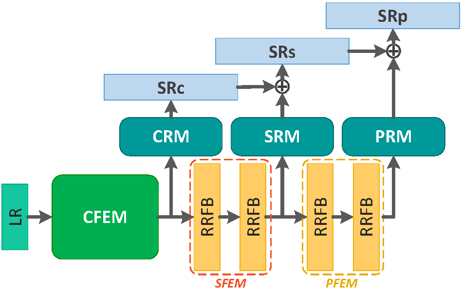
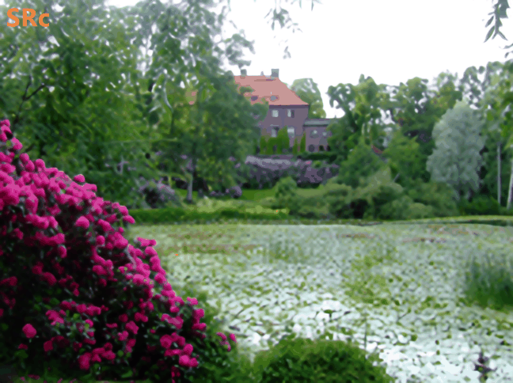
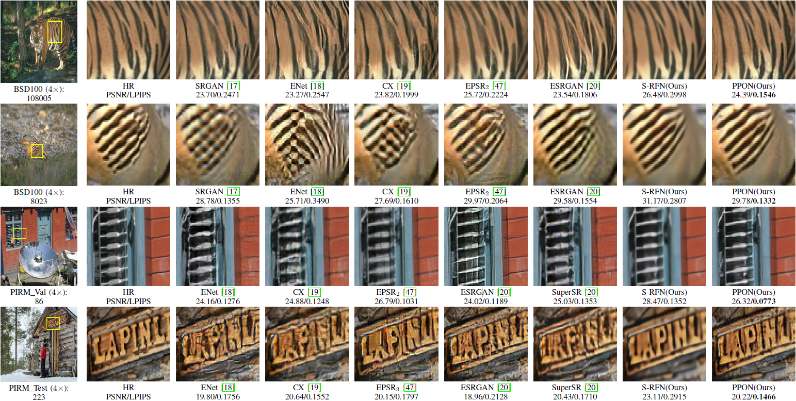
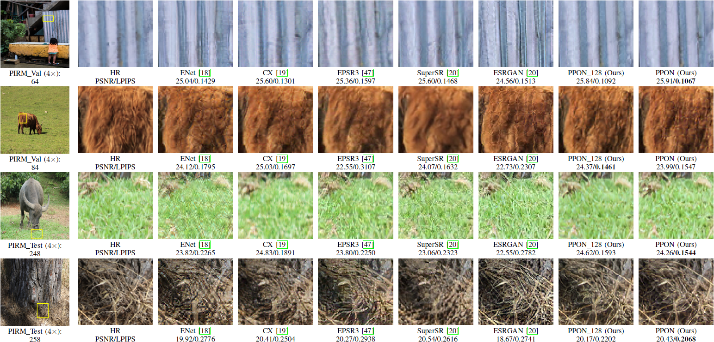

# PPON
Pytorch implemention of "Progressive Perception-Oriented Network for Single Image Super-Resolution"

[[arXiv]](https://arxiv.org/abs/1907.10399)

<p align="center">
     <br />
    <em> The schematics of the Progressive Perception-Oriented Network</em>
</p>

<p align="center">
  
</p>

<p align="center">
     <br />
    <em> The example results</em>
</p>

<p align="center">
     <br />
    <em> Visualization of intermediate feature maps</em>
</p>

## Testing
Pytorch 1.1
* Download [PIRM_dataset](https://drive.google.com/open?id=1T-B-EAZVeXfbUu6Frnpa6X2u7kxxRyvt) and unzip it into folder `Test_Datasets`
* Download [Checkpoint](https://drive.google.com/open?id=112qwpKHNt5TC3xyzGxYAhYaPHQqo_VrA) and put them into folder `ckpt`
* Run testing:
```bash
python test_PPON.py --test_hr_folder Test_Datasets/PIRM_Val/ --test_lr_folder Test_Datasets/PIRM_Val_LR/
```

## PI VS LPIPS

As illustrated in the above picture, we can obviously see that the PI score of EPSR3 (2.2666) is even better than HR (2.3885), but EPSR3 shows unnatural and lacks proper texture and structure.

## Example Results



## Citation

If you find PPON useful in your research, please consider citing:

```
@article{Hui-PPON-2019,
  title={Progressive Perception-Oriented Network for Single Image Super-Resolution},
  author={Hui, Zheng and Li, Jie and Gao, Xinbo and Wang, Xiumei},
  booktitle={arXiv:1907.10399v1},
  year={2019}
}
```
